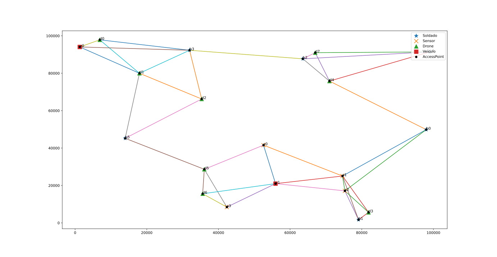
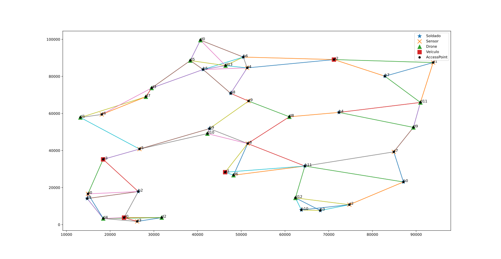
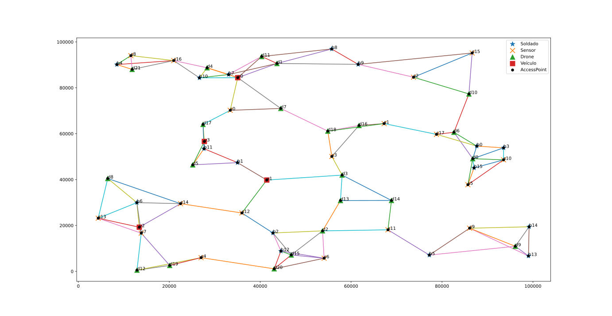
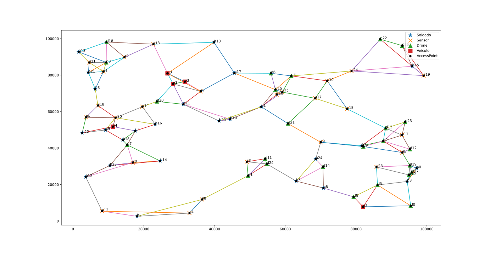
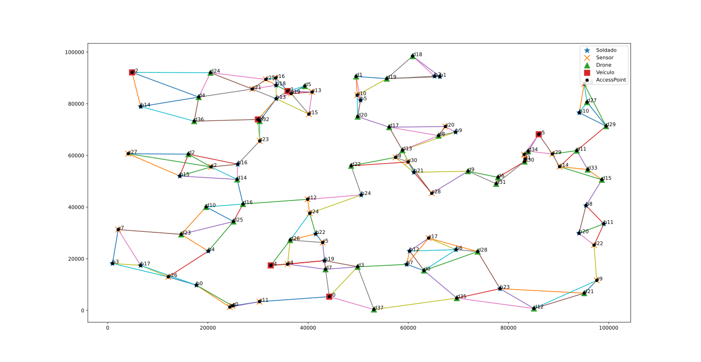

Forked from [andredxc](https://github.com/andredxc/ICNSimulations)

# ICN SDN Network

This repository contains scripts and components used in for ICN/SDN simulations

For MiniNDN and Mininet installation files see [releases](https://github.com/andredxc/ICNSimulations/releases)

## Topologies used in the experiments

**20 nodes**

**40 nodes**

**60 nodes**

**80 nodes**

**100 nodes**

